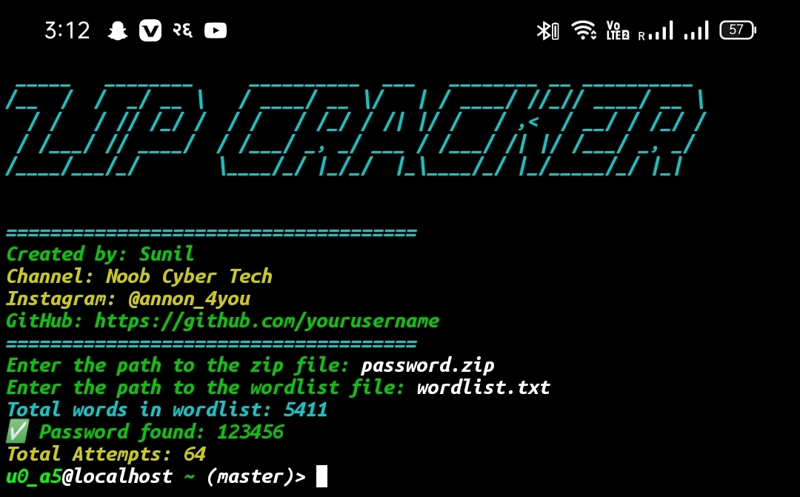

# <span style="color: #00bfff;">🔓 ZIP Cracker - Fast & Efficient Password Cracking Tool for ZIP Files 🔑</span>

## <span style="color: #32cd32;">Description</span>
**ZIP Cracker** is a **powerful yet simple** tool designed to **crack password-protected ZIP archives** using a **wordlist-based attack**. Ideal for **ethical hackers**, **cybersecurity professionals**, and anyone looking to recover passwords, this tool works seamlessly across **Linux**, **Windows**, and **macOS**. With just a ZIP file and a wordlist, this tool will attempt to break the password efficiently.

---

## <span style="color: #32cd32;">Key Features</span>
- 🚀 **High-Speed Password Cracking**  
- 🔑 **Wordlist-Based Attack**  
- 💻 **Cross-Platform Support** (Linux, Windows, macOS)  
- 🛠️ **Simple Terminal Interface**

---

## <span style="color: #32cd32;">Requirements</span>
- **Python 3.6+**
- Required libraries:
  - `pyfiglet`
  - `termcolor`

To install required libraries:
```bash
pip install pyfiglet termcolor
